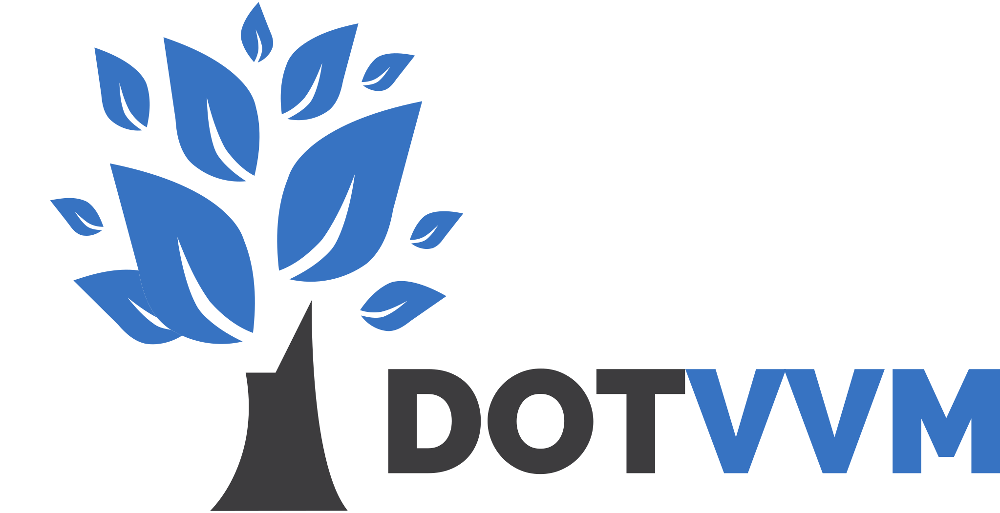

Component-based MVVM framework for ASP.NET
==================

[](https://github.com/riganti/dotvvm/blob/main/LICENSE)
[](https://gitter.im/riganti/dotvvm)
[](https://github.com/riganti/dotvvm/actions/)
[](https://www.nuget.org/packages/DotVVM/)

[DotVVM](https://www.dotvvm.com) lets you build interactive web UIs with **just C# and HTML** using the **MVVM** approach.

It simplifies building of **line of business web apps** and ships with many built-in controls like [GridView](https://www.dotvvm.com/docs/controls/builtin/GridView/latest), [FileUpload](https://www.dotvvm.com/docs/controls/builtin/FileUpload/latest), [Validator](https://www.dotvvm.com/docs/controls/builtin/Validator/latest) and more.

## How does DotVVM work?

The **Views** in DotVVM use HTML syntax with __controls__ and __data-bindings__.

The **ViewModels** are plain C# objects with properties and methods.

You can access the ViewModel properties using `{value: Name}` and call ViewModel methods using `{command: Submit()}`.

```html
<div class="form-control">
    <dot:TextBox Text="{value: Name}" />
</div>
<div class="form-control">
    <dot:TextBox Text="{value: Email}" />
</div>
<div class="button-bar">
    <dot:Button Text="Submit" Click="{command: Submit()}" />
</div>
```

```C#
public class ContactFormViewModel
{
    [Required]
    public string Name { get; set; }

    [EmailAddress]
    public string Email { get; set; }

    public void Submit()
    {
        // ...
    }
}
```

**DotVVM** comes with many features including:

* A rich set of built-in controls
    + [GridView](https://www.dotvvm.com/docs/controls/builtin/GridView/latest), [Repeater](https://www.dotvvm.com/docs/controls/builtin/Repeater/latest)
    + [FileUpload](https://www.dotvvm.com/docs/controls/builtin/FileUpload/latest)
    + [TextBox](https://www.dotvvm.com/docs/controls/builtin/TextBox/latest), [ComboBox](https://www.dotvvm.com/docs/controls/builtin/ComboBox/latest), [CheckBox](https://www.dotvvm.com/docs/controls/builtin/CheckBox/latest), [RadioButton](https://www.dotvvm.com/docs/controls/builtin/RadioButton/latest)
    + [Button](https://www.dotvvm.com/docs/controls/builtin/Button/latest), [LinkButton](https://www.dotvvm.com/docs/controls/builtin/LinkButton/latest), [RouteLink](https://www.dotvvm.com/docs/controls/builtin/RouteLink/latest)
    + [Validator](https://www.dotvvm.com/docs/controls/builtin/Validator/latest), [ValidationSummary](https://www.dotvvm.com/docs/controls/builtin/ValidationSummary/latest)
    + ...
* [Routing](https://www.dotvvm.com/docs/tutorials/basics-routing/latest)
* [Master pages](https://www.dotvvm.com/docs/tutorials/basics-master-pages/latest)
* [Advanced validation rules](https://www.dotvvm.com/docs/tutorials/basics-validation/latest) integrated with .NET data annotation attributes
* Support for [.NET cultures](https://www.dotvvm.com/docs/tutorials/basics-globalization/latest), number & date formats and RESX localization
* [SPA (Single Page App)](https://www.dotvvm.com/docs/tutorials/basics-single-page-applications-spa/latest) support
* [User controls](https://www.dotvvm.com/docs/tutorials/control-development-introduction/latest)
* MVVM with [testable ViewModels](https://www.dotvvm.com/docs/tutorials/advanced-testing-viewmodels/latest) and [Dependency injection](https://www.dotvvm.com/docs/tutorials/advanced-ioc-di-container/latest)
* [Server-side rendering](https://www.dotvvm.com/docs/tutorials/basics-server-side-html-generation/latest)
* Binding to [REST APIs](https://www.dotvvm.com/docs/tutorials/basics-rest-api-bindings/latest) and [patching viewmodel using static commands](https://www.dotvvm.com/docs/tutorials/basics-static-command-services/latest)
* Can run side-by-side with other ASP.NET frameworks (Web Forms, MVC, Razor Pages)
* **IntelliSense and tooling for Visual Studio [2019](https://marketplace.visualstudio.com/items?itemName=TomasHerceg.DotVVM-VSExtension2019), [2022](https://marketplace.visualstudio.com/items?itemName=TomasHerceg.DotVVM-VSExtension2022) and [Code](https://marketplace.visualstudio.com/items?itemName=TomasHerceg.dotvvm-vscode)**

## Getting started with DotVVM

Learn the basic principles of DotVVM in our [DotVVM Academy](https://academy.dotvvm.com) tutorials.

The easiest way to start with DotVVM is to download **[DotVVM for Visual Studio](https://www.dotvvm.com/landing/dotvvm-for-visual-studio-extension)** and do **File > New > Project**.

* Free extension for [Visual Studio 2019](https://marketplace.visualstudio.com/items?itemName=TomasHerceg.DotVVM-VSExtension2019)
* Free extension for [Visual Studio 2022](https://marketplace.visualstudio.com/items?itemName=TomasHerceg.DotVVM-VSExtension2022)

You can also [install DotVVM in existing ASP.NET projects](https://www.dotvvm.com/docs/tutorials/how-to-start-existing-app/latest) and use it side-by-side with other ASP.NET frameworks (Web Forms, MVC, Razor Pages).

There is also [dotnet new template](https://www.dotvvm.com/docs/tutorials/how-to-start-command-line/latest) for those who prefer command-line approach. You can get our free extension for [Visual Studio Code](https://marketplace.visualstudio.com/items?itemName=TomasHerceg.dotvvm-vscode).

## Current status

**DotVVM** is used in production by hundreds of developers and companies. The first stable release was in June 2016.

|                         | ASP.NET Core                | OWIN                  |
|-------------------------|-----------------------------|-----------------------|
| Current stable version  | `DotVVM.AspNetCore 4.0.*`   | `DotVVM.Owin 4.0.*`   |
| Minimum runtime version | `.NET Core 3.1`             | `.NET 4.7.2`          |
| Minimum ASP.NET version | `ASP.NET Core 3.1`          | `OWIN 4.2.2`          |

You can find the plans for next releases in the [roadmap](roadmap.md).

## Commercial components & tools

**DotVVM** framework is open source and **will always be free to use**. It's developed under [Apache license]().

There are also **free extensions** for Visual Studio and VS Code available. They are not open source, but they will also be free to use.

You can get more productive with DotVVM and **support development of the framework** by purchasing commercial components and tools developed by the creators of the framework:

* [Bootstrap for DotVVM](https://www.dotvvm.com/landing/bootstrap-for-dotvvm) brings more than fifty **Bootstrap 3 and 4** controls that are easy to use and integrate well with DotVVM validation and data-bindings.
* [DotVVM Business Pack](https://www.dotvvm.com/landing/business-pack) contains more than 30 enterprise-ready controls for large line of business web apps.
* [DotVVM Pro for Visual Studio](https://www.dotvvm.com/landing/dotvvm-for-visual-studio-professional-extension) offers more features than the free extensions - IntelliSense for data-binding expressions, real-time error checking and much more.

## Get involved

We'll be glad to accept any contribution. It doesn't need to be a pull-request - you can help us by spreading the word about the project in a blog or a user group, fix a typo in a documentation or send us your feedback and thoughts.

You can find more info in [Contribution Guidelines](contributing.md). We kindly ask you to respect the [Code of Conduct](code-of-conduct.md).

## Feedback

Feedback is crucial to make DotVVM better. You can reach us at any time on our [Gitter Chat](https://gitter.im/riganti/dotvvm).

## .NET Foundation

This project is supported by the [.NET Foundation](https://dotnetfoundation.org).

## Further reading

* [DotVVM.com](https://www.dotvvm.com)
* [DotVVM Blog](https://www.dotvvm.com/blog)
* [Documentation](https://www.dotvvm.com/docs)
* [Twitter @dotvvm](https://twitter.com/dotvvm)
* [Gitter Chat](https://gitter.im/riganti/dotvvm)
* [Samples](https://github.com/search?q=topic%3Adotvvm-sample+org%3Ariganti&type=Repositories)
* [Roadmap](https://github.com/riganti/dotvvm/blob/master/roadmap.md)
